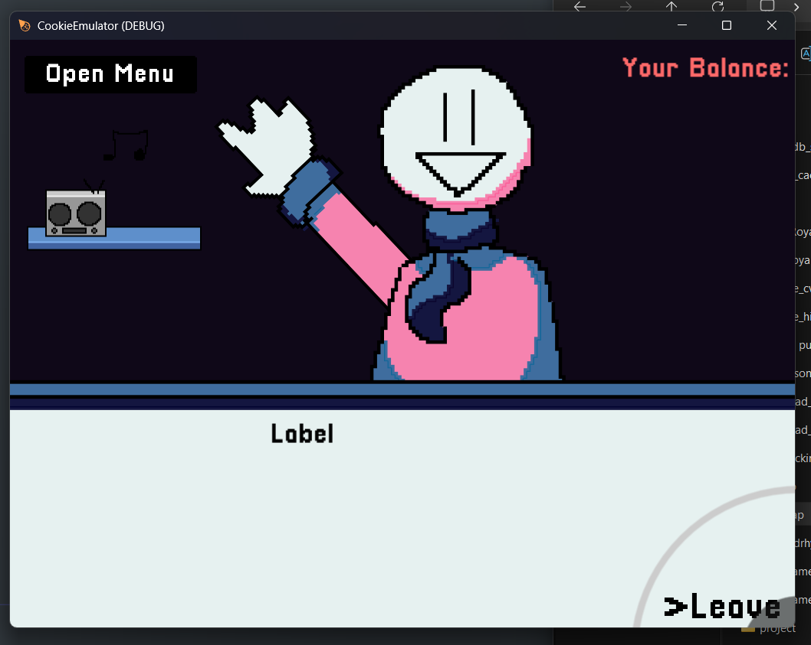
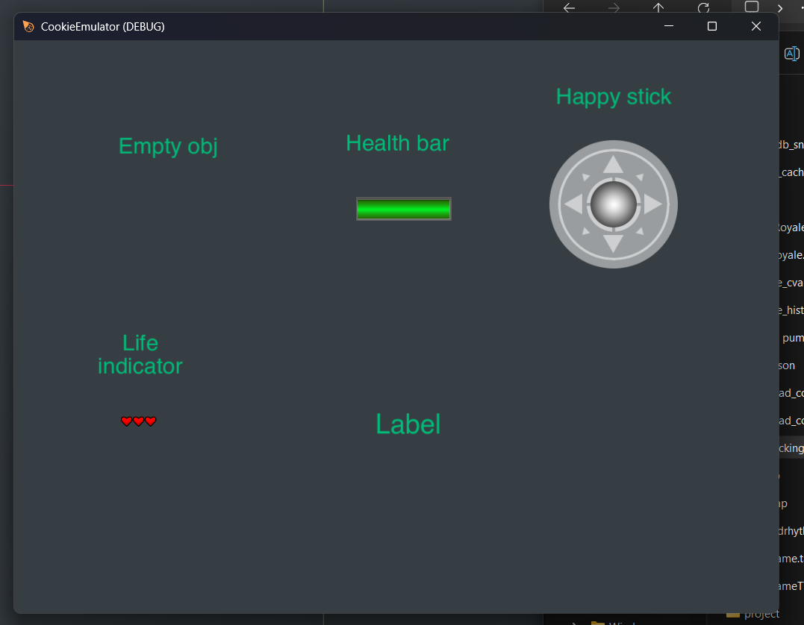
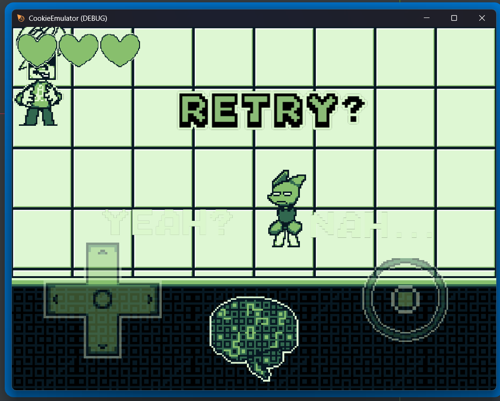
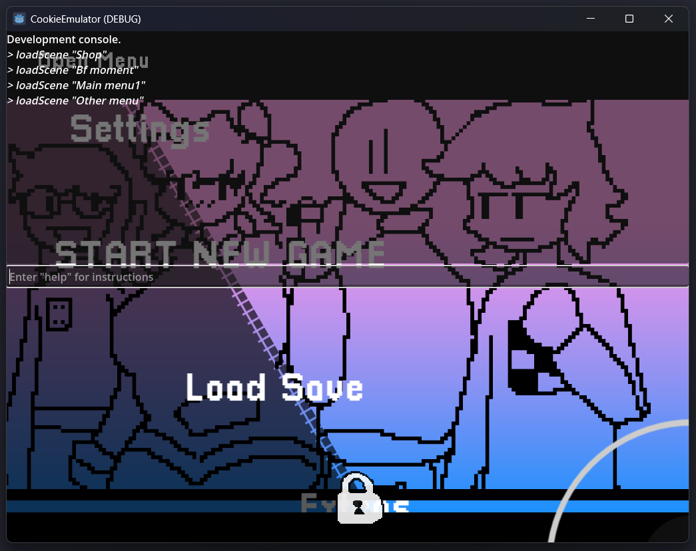

# METEOR
<div align="center">
  

  Hyperpad **.tap** player made with Godot 4.7 Mono

<p align="center">
  &nbsp;&nbsp;&nbsp;&nbsp;
  
</p>
<p align="center">
  &nbsp;&nbsp;&nbsp;&nbsp;
  
</p>
</div>

> Note: This project only runs .tap files. It is not an alternative to the [Hyperpad Game Engine](https://www.hyperpad.com/)

Meteor is a Hyperpad .tap player similar to the [Hyperpad Hub Player](https://apps.apple.com/us/app/hyperpad-hub/id1484881474?platform=ipad) on IOS and IpadOS except built using Godot to give you the ability to play hyperpad games on Windows/Linux. All logic code will eventually  be converted into C#

- Extracts sqlite data from .tap and converts it to JSON.
- Extracts image, audio, ttfont, and bitmap font assets.

> [!WARNING]
> This project is still in early development, so features are going to be missing.

#### Todo

- [x] Empty Objects
- [x] Life Objects
- [x] Health Bar Objects
- [x] Joystick Objects
- [x] Graphic Objects
- [x] Layers
    - [x] z-order
    - [x] normal layers
    - [x] UI layers
- [x] tags
- [x] collision shapes
  - [x] Graphic Objects
  - [x] Empty Objects
  - [ ] LifeObjects
  - [ ] HelathBars
  - [ ] Joystick
  - [ ] Labels
- [ ] Behaviors
  - [ ] Array
  - [ ] Authenticate OAuth
  - [ ] Battery Status
  - [ ] Behavior Bundle
  - [ ] Behaviour Off
  - [ ] Behaviour On
  - [ ] Bitwise Operation
  - [ ] Boolean
  - [ ] Box Container
  - [ ] Broadcast Message
  - [ ] Calculate Direction
  - [ ] Calculate Distance
  - [ ] Clamp Value
  - [ ] Clipboard
  - [ ] Combine Text
  - [ ] Comment
  - [ ] Connect to Socket
  - [ ] Create Collision
  - [ ] Delete from File
  - [ ] Device Identifier
  - [ ] Dictionary
  - [ ] Draw
  - [ ] Edit Text Event
  - [ ] Edit Text Field
  - [ ] Emit to Socket
  - [ ] Execute Behaviour
  - [ ] Execute Sequence
  - [x] Frame Event
    - Unsure, should check bugs for it
  - [ ] Get Array Count
  - [ ] Get Array Value
  - [ ] Get Background
  - [ ] Get Bounding Box
  - [ ] Get Dictionary Value
  - [ ] Get Life Indicator
  - [ ] Get Mouse Position
  - [ ] Get Noise Value
  - [ ] Get OAuth Credentials
  - [ ] Get Object
  - [ ] Get Objects By Tag
  - [ ] Get Pixel
  - [ ] Get Socket Status
  - [ ] Get Time
  - [ ] HTTP Request
  - [ ] HitPoint Test
  - [ ] If
  - [ ] Indicator Event
  - [ ] Interpolate Value
  - [ ] Is Intersecting
  - [ ] Keyboard Event
  - [ ] Keyboard Shortcut
  - [ ] Load Image
  - [ ] Load Scene
    - [ ] Transitions
     - [x] none 
  - [ ] Load from File
  - [ ] Loop
  - [ ] Math Expression
  - [ ] Math Function
  - [ ] Maximum
  - [ ] Minimum
  - [ ] Modify Array
  - [ ] Modify Dictionary
  - [ ] Modify Save File
  - [ ] Modify Tags
  - [ ] Mouse Event
  - [x] Move By
  - [ ] Noise Map
  - [ ] Open URL
  - [ ] Post to Facebook
  - [ ] Quit Project
  - [ ] Random Number
  - [ ] Raycast Test
  - [ ] Receive Message
  - [ ] Remove OAuth Credentials
  - [ ] Render Texture
  - [ ] Round Number
  - [ ] Save to File
  - [ ] Set Background
  - [ ] Set Background Color
  - [ ] Set Behavior State
  - [ ] Set Cursor Style
  - [ ] Set Music Settings
  - [ ] Set Physics Mode
  - [ ] Set Physics Property
  - [ ] Set Sound Settings
  - [ ] Set Visibility
  - [ ] Share
  - [ ] Socket Event
  - [ ] Socket.io Client
  - [ ] Sort Array
  - [ ] Sort by Distance
  - [ ] Start Trail
  - [x] Started Touching
  - [ ] Stop Visual Effects
  - [ ] Subtract Values
  - [ ] Swipe Gesture
  - [ ] Text Length
  - [ ] Text Operation
  - [x] Timer
  - [ ] Track Event
  - [ ] Trim Text
  - [ ] Tweet
  - [ ] Value
  - [x] Wait

## Developer Console
Meteor includes a developer console for debugging and extra useful features. Press **~** to activate it

**Commands List**
```
loadScene <Scene Name : String>
```

## Prerequisites
If youd like to contribute to Meteor you need to have Python installed with these packages as well as Godot 4.7 Mono.
```
import base64
import json
import os
import plistlib
import re
import sqlite3
import tempfile
import zipfile
from plistlib import UID
```

